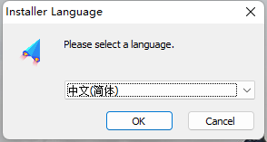
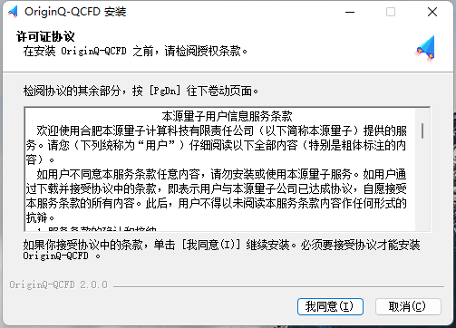
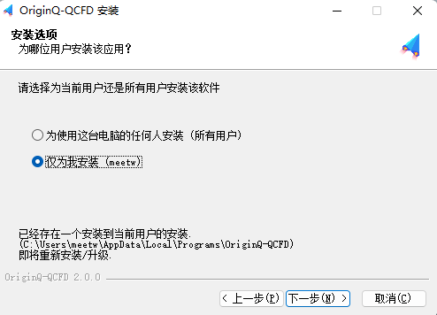
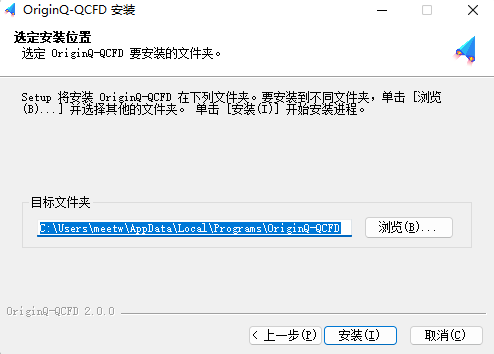

安装介绍
=====================
在本源量子云 (https://qcloud.originqc.com.cn/QCFD) 点击下载并双击OriginQ-QCFD.exe，根据向导安装。

1.	选择软件安装语言，默认为“中文简体”，点击“OK”按钮，安装中文版软件，若需要安装英文版软件，请选择安装语言为“English”；

.. centered:: 图1-1 选择安装语言

2.	在弹出的安装界面点击“我同意”；

.. centered:: 图1-2 选择“我同意”

3.	在“安装选项”界面，指定为哪位用户安装该软件，然后点击下一步，并指定安装路径。

.. centered:: 图1-3 安装选项页面

.. centered:: 图1-4 选定安装位置